<p align="center">
  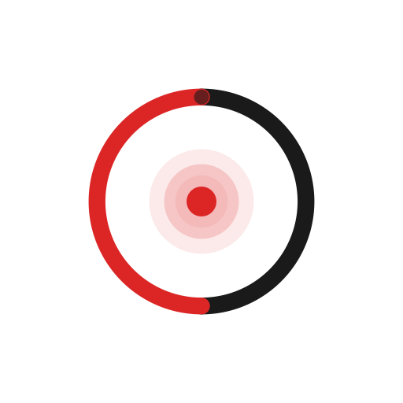
</p>

<h1 align="center">结绳</h1>

<p align="center">
  <strong>全本地运行的 Android 朋友人脉关系管理软件</strong>
  <br />
  所有数据存储在本地，无需注册账号，无需网络连接
  <br />
  软件全由 AI 开发制作，有问题提 issue，我会尽量修复，更新可能随缘
</p>

<p align="center">
  <a href="LICENSE"></a>
  
  
  
</p>

<p align="center">
  <a href="#功能总览">功能总览</a>
  ·
  <a href="#截图预览">截图预览</a>
  ·
  <a href="#安装使用">安装使用</a>
  ·
  <a href="#开发与构建">开发与构建</a>
  ·
  <a href="#技术栈">技术栈</a>
  ·
  <a href="#项目结构">项目结构</a>
</p>

## 功能总览

### 朋友档案

- 记录朋友的姓名、昵称、电话、学校、公司、职务、城市、地址、爱好、习惯、饮食、技能、简介等信息。
- 自定义关系标签（家人、同学、同事等），支持新增和删除。
- 亲密度系统：0-100 分滑块，自动划分为家人、亲密、朋友、熟人、新识五个等级。
- 三种视图切换：网格、列表（支持拖拽排序）、卡牌（支持翻转）。
- 详情页整合资料、事件、纪念日、礼物、想法、对话六大板块。

### 互动事件

- 记录见面、聚餐、通话等日常互动，支持自定义事件类型和图标。
- 记录天气、心情、地点、个人感悟，信纸风格编辑体验。
- 拍立得风格照片展示，支持多图上传和全屏预览。
- 可关联多个参与的朋友，列表视图和时间轴视图自由切换。
- 事件详情支持收藏、分享（系统分享，含文字和图片）。

### 纪念日提醒

- 支持生日、纪念日、节日三种类型，可关联朋友。
- 农历日期支持，自动转换。
- 倒计时展示：7天内红色提醒，30天内橙色提示。
- 定时通知推送，不错过每一个重要的日子。

### 礼物往来

- 记录送出和收到的礼物，区分方向，支持金额、分类、场合、地点等详细信息。
- 磁带收藏室视觉风格：每份礼物都是一盒独特的磁带，复古控制面板统计送出/收到比例。
- 按类型频谱筛选，按朋友筛选，磁带卡片点击查看详情。
- 礼物详情页卷轴动画、磁头标识、影像记录浏览。

### 想法笔记

- 三种类型：伙伴、计划、碎碎念，支持待办标记和截止日期。
- 经验值与等级系统，连续打卡记录，记录越多等级越高。
- 关联朋友，按朋友头像筛选（类似 Stories），按类型和待办状态过滤。
- 支持私密标记、收藏，在朋友详情页查看与 TA 相关的所有想法。

### 对话记录

- 剧本式对话编辑器：添加"我说了"和"对方说了"，支持插入图片。
- 对话详情以聊天气泡形式展示，深色模式自适应。
- 记录对话场景信息：日期、天气、心情。
- 对话列表和分组视图，按朋友分组浏览。

### 圈子分组

- 将朋友归入不同圈子，自定义圈子名称、描述、颜色。
- 终端风格界面，圈子档案卡片可展开/折叠，成员卡牌支持翻转。
- 支持添加、移除成员，点击成员跳转到朋友详情。

### 足迹

- 自动从事件地点中提取足迹记录。
- 按年份筛选，列表视图和时间轴视图切换。
- 统计足迹数、城市数、朋友数。

### 往来相册

- 自动汇总事件、对话、礼物中的所有照片。
- 三种浏览方式：按日期、按事件来源、纯网格。
- 按来源类型和朋友筛选，滑动浏览大图，支持收藏。

### 收藏夹

- 跨类型收藏：事件、礼物、想法统一管理。
- 终端风格界面，四种视图：列表、详情卡片、树状统计、操作日志。
- 点击可跳转回原始内容。

### 数据与隐私

- 所有数据存储在本地 Room 数据库，无需注册，无需联网。
- 本地 ZIP 备份/恢复，覆盖数据库、设置和图片文件。
- 图片自动复制到应用私有目录，即使原始图片被删除也不受影响。

### 主题

- 浅色、深色、跟随系统三种模式。
- Material 3 动态取色，沉浸式状态栏与导航栏。

## TODO

- [ ] 适配平板
- [ ] 新增 WebDAV 同步

## 截图预览

<table>
  <tr>
    <td>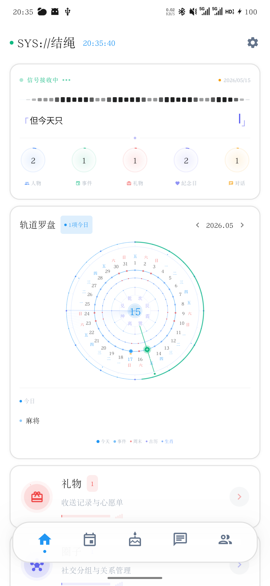</td>
    <td>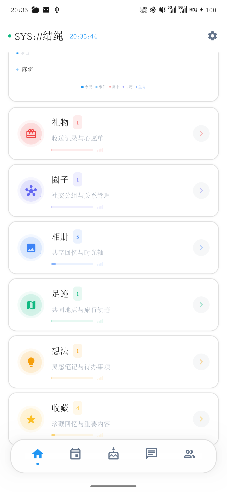</td>
  </tr>
  <tr>
    <td>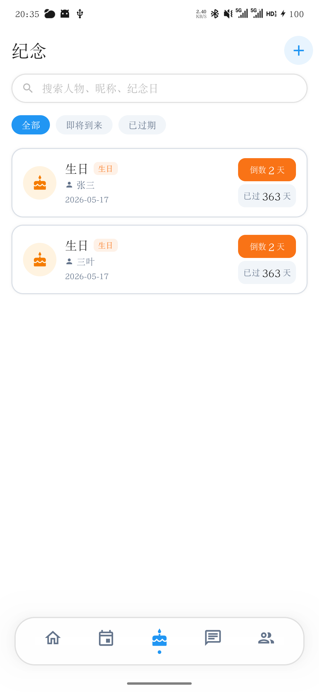</td>
    <td>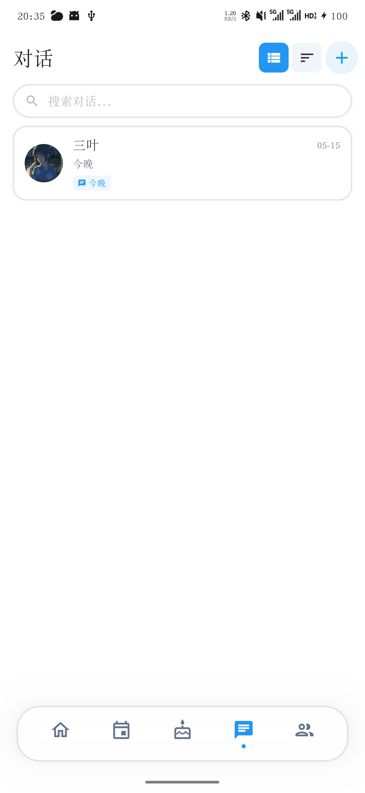</td>
  </tr>
  <tr>
    <td>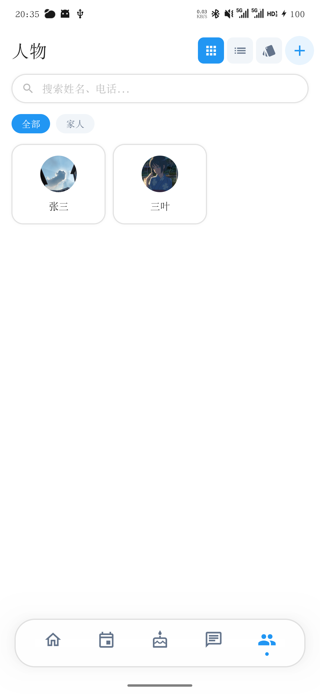</td>
    <td>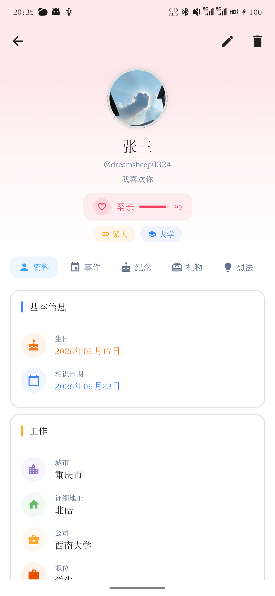</td>
  </tr>
  <tr>
    <td>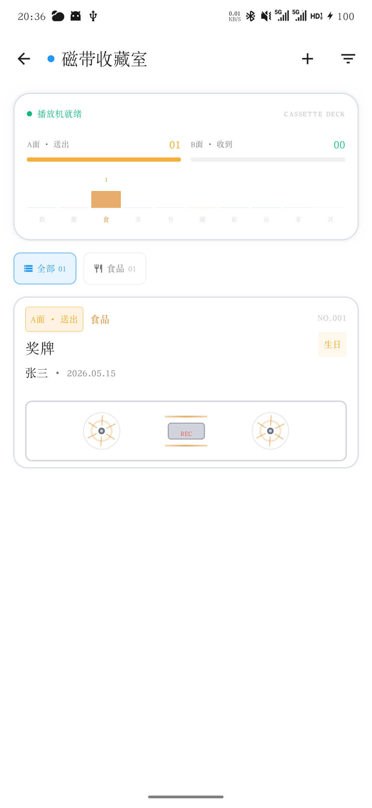</td>
    <td>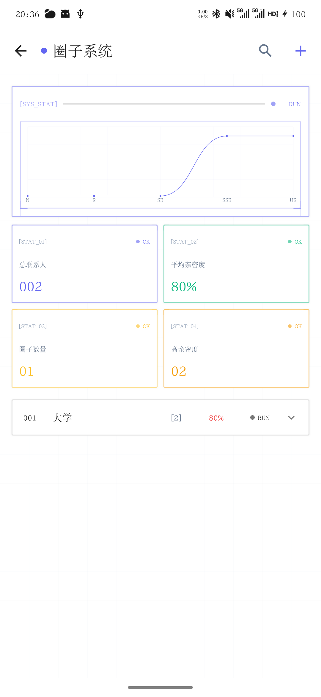</td>
  </tr>
  <tr>
    <td>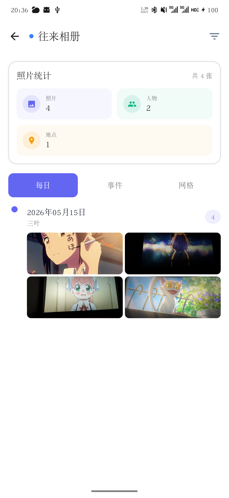</td>
    <td>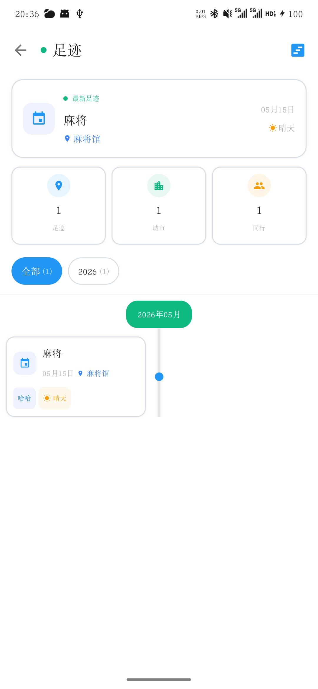</td>
  </tr>
  <tr>
    <td>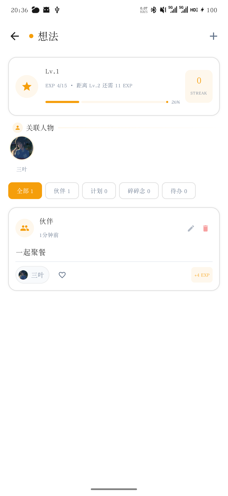</td>
    <td>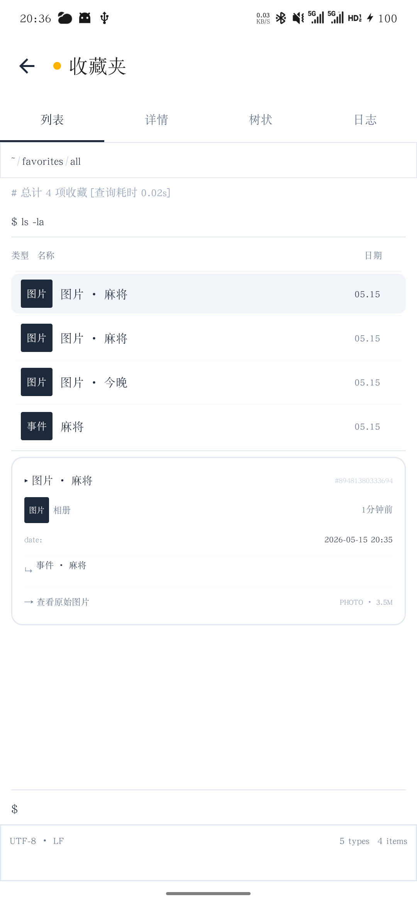</td>
  </tr>
</table>

## 安装使用

前往 [Releases](https://github.com/dreamsheep0324/Knots/releases) 下载最新 APK 安装包。

系统要求：Android 8.0（API 26）及以上。

安装后即可直接使用，无需注册账号，无需网络连接。

## 开发与构建

### 环境要求

- Android Studio Hedgehog 及以上
- JDK 17
- Android SDK 34
- Kotlin 1.9

### 本地开发

1. 克隆项目

```shell
git clone https://github.com/dreamsheep0324/Knots.git
cd Knots
```

2. 使用 Android Studio 打开项目

3. 同步 Gradle 后连接设备运行

### 构建 APK

```shell
./gradlew assembleDebug
```

构建产物输出到 `app/build/outputs/apk/debug/`。

## 技术栈

- UI 框架：Jetpack Compose + Material 3
- 架构模式：MVVM + Clean Architecture
- 依赖注入：Hilt
- 本地数据库：Room
- 偏好存储：DataStore Preferences
- 图片加载：Coil
- 页面导航：Navigation Compose
- 农历转换：6tail lunar
- 编程语言：Kotlin

## 项目结构

```text
YU
├─ app/src/main/java/com/tang/prm
│  ├─ data                        # 数据层
│  │  ├─ local/dao                # Room DAO 接口
│  │  ├─ local/database           # 数据库定义与版本迁移
│  │  ├─ local/entity             # 数据库实体
│  │  ├─ mapper                   # Entity ↔ Domain 映射
│  │  └─ repository               # Repository 实现
│  ├─ di                          # Hilt 依赖注入模块
│  ├─ domain                      # 领域层
│  │  ├─ model                    # 领域模型
│  │  ├─ repository               # Repository 接口
│  │  └─ usecase                  # 用例
│  ├─ service                     # 后台服务（提醒通知）
│  ├─ ui                          # 表现层
│  │  ├─ animation/core           # 动画引擎与令牌
│  │  ├─ animation/primitives     # 基础动画原语
│  │  ├─ animation/composites     # 组合动画组件
│  │  ├─ components               # 通用 UI 组件
│  │  ├─ navigation               # 导航图与路由
│  │  ├─ theme                    # 主题、颜色、字体
│  │  ├─ contacts                 # 联系人模块
│  │  ├─ events                   # 事件模块
│  │  ├─ anniversary              # 纪念日模块
│  │  ├─ chat                     # 对话模块
│  │  ├─ home                     # 首页模块
│  │  └─ profile                  # 设置模块
│  └─ util                        # 工具类
└─ app/src/main/res               # 资源文件
```

## 声明与致谢

结绳的灵感来源于 [我是鱼 - 人际关系管理&人脉维系工具](https://apps.apple.com/cn/app/%E6%88%91%E6%98%AF%E9%B1%BC-%E4%BA%BA%E9%99%85%E5%85%B3%E7%B3%BB%E7%AE%A1%E7%90%86-%E4%BA%BA%E8%84%89%E7%BB%B4%E7%B3%BB%E5%B7%A5%E5%85%B7/id6450589948)，是它让我意识到人际关系值得被认真记录和用心维系，在此向原作者致以最诚挚的感谢。如原作者或相关权利方认为本仓库存在不妥，请随时联系我，我会第一时间处理。

本项目由 AI 辅助开发完成，代码难免有不足之处。如果你有任何建议、意见或发现 bug，欢迎提 issue 或 PR，非常期待各位大佬的指点和交流

## 开源协议

代码基于 [MIT License](LICENSE) 开源。
