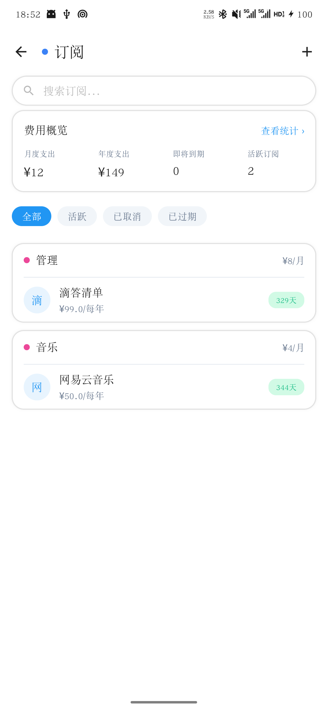
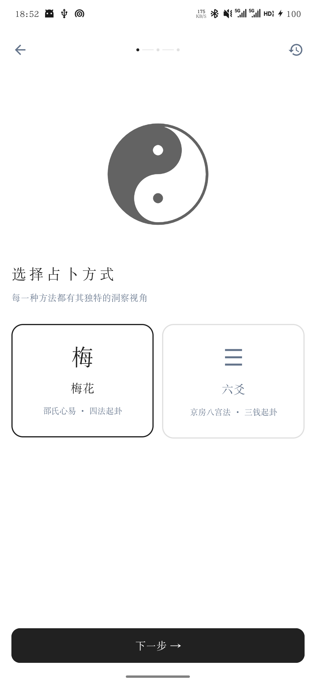

<p align="center">
  
</p>

<h1 align="center">结绳</h1>

<p align="center">
  <strong>全本地运行的 Android 朋友人脉关系管理软件</strong>
  <br />
  所有数据存储在本地，无需注册账号，无需网络连接
  <br />
  软件全由 AI 开发制作，有问题提 issue，我会尽量修复，更新可能随缘
</p>

<p align="center">
  <a href="LICENSE"></a>
  
  
  
</p>

<p align="center">
  <a href="#功能总览">功能总览</a>
  ·
  <a href="#截图预览">截图预览</a>
  ·
  <a href="#安装使用">安装使用</a>
  ·
  <a href="#开发与构建">开发与构建</a>
  ·
  <a href="#技术栈">技术栈</a>
  ·
  <a href="#项目结构">项目结构</a>
</p>

## 功能总览

### 朋友档案

- 记录姓名、昵称、电话、学校、公司、职务、城市、地址、爱好、习惯、饮食、技能、MBTI、简介等丰富信息。
- 自定义关系标签（家人、同学、同事等），支持新增、删除和颜色选择。
- 亲密度系统：0-100 分滑块，自动划分为至亲、密友、朋友、泛交、初识五个等级。
- 星座标签：根据出生日期自动计算，12 星座各有矢量图标和专属色。
- 相识天数：基于相识日期自动计算并展示。
- 头像裁剪：上传头像后支持圆形蒙版裁剪，单指拖动、双指缩放，512×512 输出。
- 三种视图切换：网格、列表（支持拖拽排序）、卡牌（支持翻转）。
- 详情页整合资料、事件、纪念日、礼物、想法、对话六大板块。

### 互动事件

- 记录见面、聚餐、通话等日常互动，支持自定义事件类型、颜色和图标。
- 记录天气、心情、地点、个人感悟，信纸风格编辑体验。
- 拍立得风格照片展示，支持多图上传和全屏预览。
- 可关联多个参与的朋友，列表视图和时间轴视图自由切换。
- 事件详情支持收藏、分享（系统分享，含文字和图片）。

### 纪念日提醒

- 支持生日、纪念日、节日三种类型，可关联朋友。
- 农历日期支持，自动转换。
- 倒计时展示：7 天内红色提醒，30 天内橙色提示。
- 定时通知推送，不错过每一个重要的日子。

### 礼物往来

- 记录送出和收到的礼物，区分方向，支持金额、分类、场合、地点等详细信息。
- 磁带收藏室视觉风格：每份礼物都是一盒独特的磁带，复古控制面板统计送出/收到比例。
- 按类型频谱筛选，按朋友筛选，磁带卡片点击查看详情。
- 礼物详情页卷轴动画、磁头标识、影像记录浏览。

### 想法笔记

- 三种类型：伙伴、计划、碎碎念，支持待办标记和截止日期。
- 经验值与等级系统，连续打卡记录，记录越多等级越高。
- 关联朋友，按朋友头像筛选（类似 Stories），按类型和待办状态过滤。
- 支持私密标记、收藏，在朋友详情页查看与 TA 相关的所有想法。

### 对话记录

- 剧本式对话编辑器：添加"我说了"和"对方说了"，支持插入图片。
- 对话详情以聊天气泡形式展示，深色模式自适应。
- 记录对话场景信息：日期、天气、心情。
- 对话列表和分组视图，按朋友分组浏览。

### 圈子分组

- 将朋友归入不同圈子，自定义圈子名称、描述、颜色和波形。
- 终端风格界面，圈子档案卡片可展开/折叠，成员卡牌支持翻转。
- 支持添加、移除成员，点击成员跳转到朋友详情。

### 足迹

- 自动从事件地点中提取足迹记录。
- 按年份筛选，列表视图和时间轴视图切换。
- 统计足迹数、城市数、朋友数。

### 往来相册

- 自动汇总事件、对话、礼物中的所有照片，支持多人物显示。
- 三种浏览方式：按日期、按事件来源、纯网格。
- 按来源类型和朋友筛选，滑动浏览大图，支持收藏。

### 收藏夹

- 跨类型收藏：事件、礼物、想法统一管理。
- 终端风格界面，四种视图：列表、详情卡片、树状统计、操作日志。
- 点击可跳转回原始内容。

### 订阅管理

- 记录各类订阅服务，支持周付、月付、季付、年付、一次性五种扣费周期。
- 自动计算日均、月均、年均费用，智能推算下次扣费日期。
- 统计页：年度预估、关键指标网格、分类占比圆环图（8 色柔和配色）、扣费日历。
- 订阅状态自动判断：下次扣费日早于当前时间标记为已过期。

### 占卜

- 六爻占卜：基于《增删卜易》方法论，支持手动摇卦输入，自动装卦（纳甲、六亲、六神、世应），AI 断卦解读。
- 梅花易数：基于邵雍《梅花易数》方法论，支持时间起卦、数字起卦、外应起卦三种方式，体用生克分析，AI 深度解读。
- AI 解读通过 SSE 流式输出，支持深度追问。
- 占卜历史记录，随时回顾。

### 轨道罗盘

- 赛博星图风格日历罗盘，实时展示月份进度、事件热力、日期分布。
- 粒子环、脉冲波纹、渐变弧线、星座连线等动态视觉效果。
- 今日事件、即将到来事件、下一事件倒计时。

### AI 助手

- 配置自定义 AI 模型和 API 密钥，支持 DeepSeek 等兼容接口。
- 占卜断卦、深度追问等 AI 功能。
- 密钥加密存储，安全可靠。

### 数据与隐私

- 所有数据存储在本地 Room 数据库，无需注册，无需联网。
- 本地 ZIP 备份/恢复，覆盖数据库、设置和图片文件。
- WebDAV 增量同步：基于 manifest.json 清单 + diff 计算，仅传输变更文件到用户自有云存储（坚果云、NextCloud、Synology 等）。
- 图片自动复制到应用私有目录，即使原始图片被删除也不受影响。
- 孤立图片清理：自动检测并清理裁剪残留等未被数据库引用的图片文件。
- API 密钥和 WebDAV 密码使用 EncryptedSharedPreferences 加密存储。

### 主题

- 浅色、深色、跟随系统三种模式。
- Material 3 动态取色，沉浸式状态栏与导航栏。

## TODO

- [ ] 适配平板

## 截图预览

<table>
  <tr>
    <td width="50%"></td>
    <td width="50%"></td>
  </tr>
  <tr>
    <td width="50%"></td>
    <td width="50%"></td>
  </tr>
  <tr>
    <td width="50%"></td>
    <td width="50%"></td>
  </tr>
  <tr>
    <td width="50%"></td>
    <td width="50%"></td>
  </tr>
  <tr>
    <td width="50%"></td>
    <td width="50%"></td>
  </tr>
  <tr>
    <td width="50%"></td>
    <td width="50%"></td>
  </tr>
  <tr>
    <td width="50%"></td>
    <td width="50%"></td>
  </tr>
</table>

## 安装使用

前往 [Releases](https://github.com/dreamsheep0324/Knots/releases) 下载最新 APK 安装包。

系统要求：Android 8.0（API 26）及以上。

安装后即可直接使用，无需注册账号，无需网络连接。

## 开发与构建

### 环境要求

- Android Studio Meerkat 及以上
- JDK 17
- Android SDK 35
- Kotlin 2.1.21

### 本地开发

1. 克隆项目

```shell
git clone https://github.com/dreamsheep0324/Knots.git
cd Knots
```

2. 使用 Android Studio 打开项目

3. 同步 Gradle 后连接设备运行

### 构建 APK

```shell
./gradlew assembleDebug
```

构建产物输出到 `app/build/outputs/apk/debug/`。

## 技术栈

- UI 框架：Jetpack Compose + Material 3
- 架构模式：MVVM + Clean Architecture（16 模块）
- 依赖注入：Hilt
- 本地数据库：Room 2.7.0
- 序列化：kotlinx-serialization
- 偏好存储：DataStore Preferences + EncryptedSharedPreferences
- 图片加载：Coil
- 页面导航：Navigation Compose（Type-Safe `@Serializable`）
- 网络请求：OkHttp（SSE 流式 AI + WebDAV 增量同步）
- 农历转换：6tail lunar 1.7.7
- 加密存储：AndroidX Security Crypto
- 编译器插件：Kotlin 2.1.21（K2）、Compose Compiler、KSP 2.1.21-2.0.2
- 构建工具：AGP 8.9.0

## 项目结构

```text
YU
├─ app/                            # 壳模块：单 Activity + 导航宿主
├─ core/
│  ├─ domain/                      # 纯 JVM：领域模型 + Repository 接口 + UseCase + 工具类
│  ├─ data/                        # Android Library：Entity + DAO + Mapper + RepositoryImpl + DI + 迁移 + ImageFileManager
│  └─ ui/                          # Android Library：主题 + 动画 + 通用组件 + 导航路由 + AvatarCropDialog
├─ engine/
│  └─ divination/                  # 纯 JVM：占卜计算引擎（六爻/梅花易数/干支历法/五行生克）
├─ feature/
│  ├─ home/                        # 首页：频道网格 + 信号卡片 + 轨道罗盘
│  ├─ events/                      # 互动事件：列表/详情/新建/编辑
│  ├─ chat/                        # 对话记录：列表/详情/新建/编辑 + DialogueLineManager
│  ├─ gifts/                       # 礼物往来：列表/详情/新建/编辑（磁带风格）
│  ├─ remember/                    # 纪念日：列表/详情/新建/编辑/筛选
│  ├─ people/                      # 联系人：列表/新建/详情/卡片翻转
│  ├─ reflect/                     # 想法 + 收藏 + 足迹 + 相册
│  ├─ subscription/                # 订阅管理：列表/新建/详情/统计（圆环图+扣费日历）
│  ├─ divination/                  # 占卜：六爻/梅花/AI 解读/历史
│  ├─ circle/                      # 圈子分组：终端风格界面
│  └─ profile/                     # 设置：备份恢复 + WebDAV 增量同步 + AI 配置 + 关于
└─ docs/                           # 文档
```

## 声明与致谢

结绳的灵感来源于 [我是鱼 - 人际关系管理&人脉维系工具](https://apps.apple.com/cn/app/%E6%88%91%E6%98%AF%E9%B1%BC-%E4%BA%BA%E9%99%85%E5%85%B3%E7%B3%BB%E7%AE%A1%E7%90%86-%E4%BA%BA%E8%84%89%E7%BB%B4%E7%B3%BB%E5%B7%A5%E5%85%B7/id6450589948)，是它让我意识到人际关系值得被认真记录和用心维系，在此向原作者致以最诚挚的感谢。如原作者或相关权利方认为本仓库存在不妥，请随时联系我，我会第一时间处理。

本项目由 AI 辅助开发完成，代码难免有不足之处。如果你有任何建议、意见或发现 bug，欢迎提 issue 或 PR，非常期待各位大佬的指点和交流

## 开源协议

代码基于 [MIT License](LICENSE) 开源。
